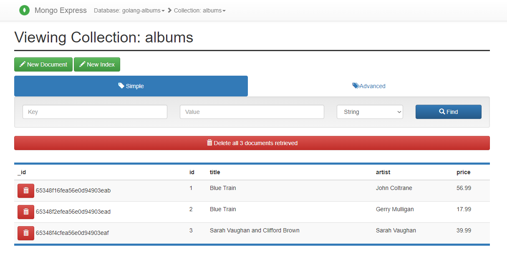
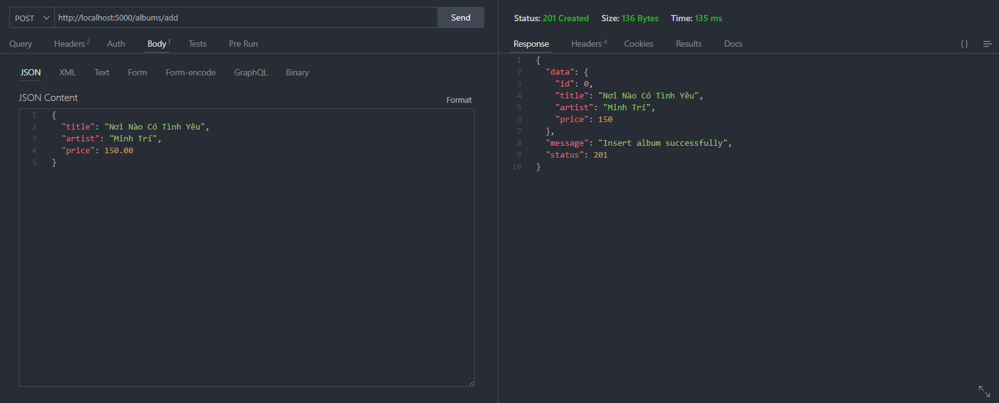

> ## Golang Restfull API Docker Document

## RUN DOCKER: `docker-compose -f .\docker-compose.yml up`

## RUN SERVER: `go run main.go`

## Open Mongo-express browser: `http://localhost:8081`
### Username: `root`
### Password: `root`

## API Listing

### Get All Albums:

`GET: http://localhost:5000/albums`

**Response**

```php
{
  "data": [
    {
      "_id": "65348f16fea56e0d94903eab",
      "artist": "John Coltrane",
      "id": 1,
      "price": 56.99,
      "title": "Blue Train"
    },
    {
      "_id": "65348f2efea56e0d94903ead",
      "artist": "Gerry Mulligan",
      "id": 2,
      "price": 17.99,
      "title": "Blue Train"
    },
    {
      "_id": "65348f4cfea56e0d94903eaf",
      "artist": "Sarah Vaughan",
      "id": 3,
      "price": 39.99,
      "title": "Sarah Vaughan and Clifford Brown"
    }
  ],
  "status": 200
}
```

### Insert New Album:

`POST: http://localhost:5000/albums/add`

**Request Body**

```php
{
  "id": 4,
  "title": "Nơi Nào Có Tình Yêu",
  "artist": "Minh Trí",
  "price": 150.00
}
```

**Response**

```php
{
  "data": {
    "id": 4,
    "title": "Nơi Nào Có Tình Yêu",
    "artist": "Minh Trí",
    "price": 150
  },
  "message": "Insert album successfully",
  "status": 200
}
```

### Showcases:

**GET Method**



**POST Method**

